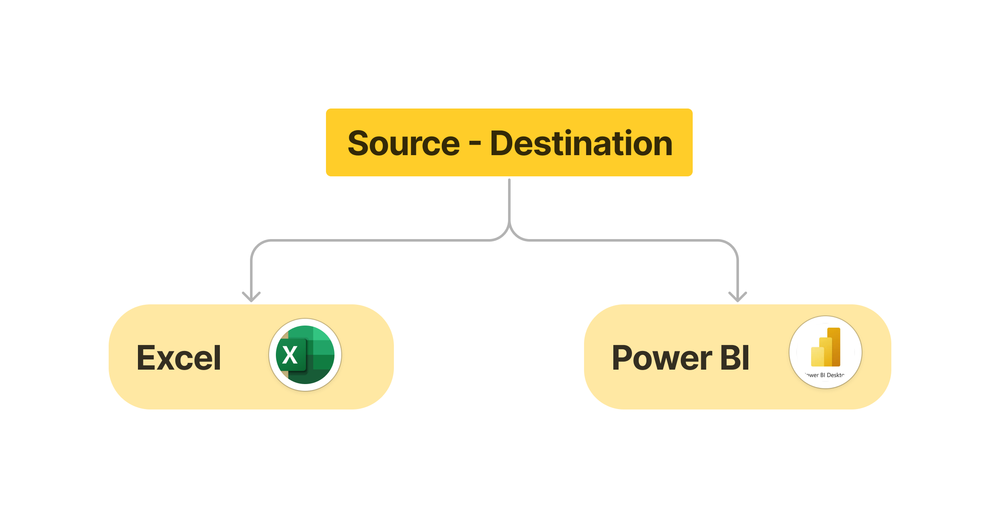
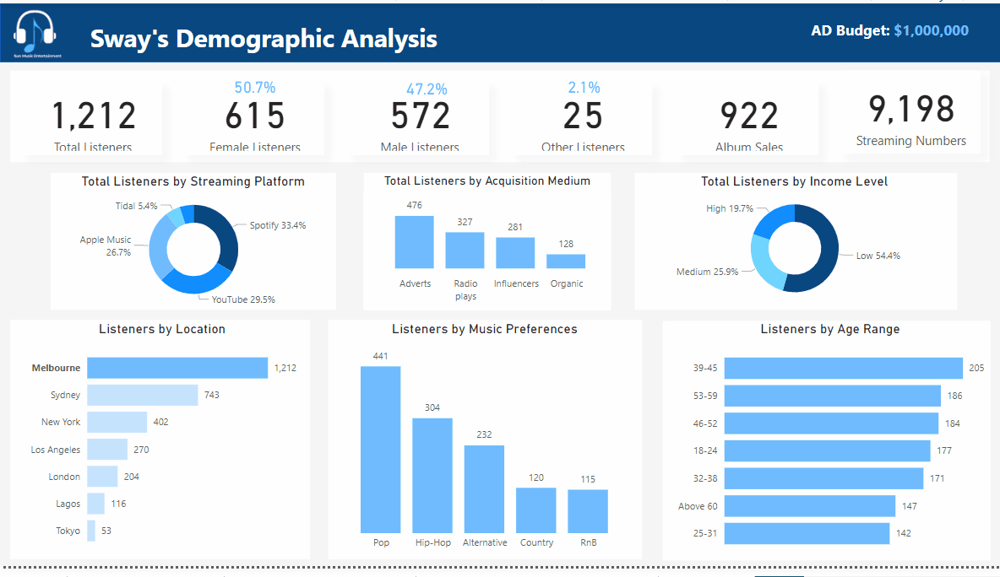
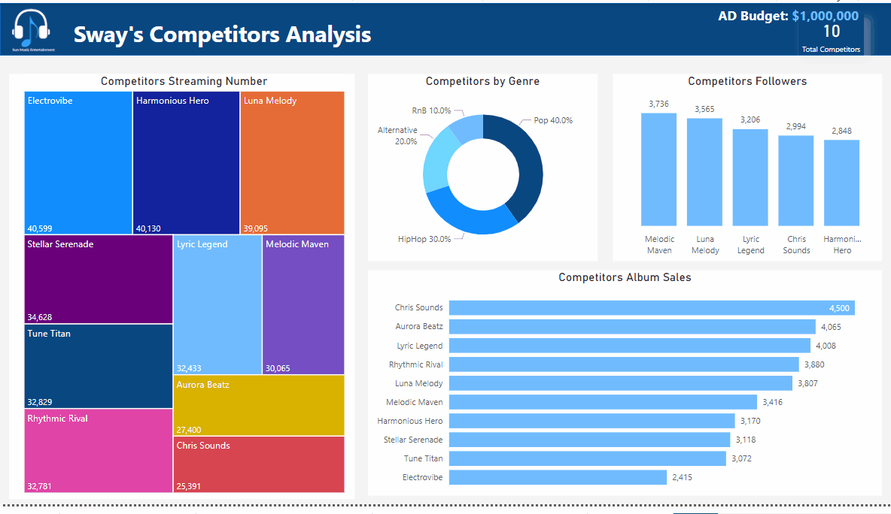
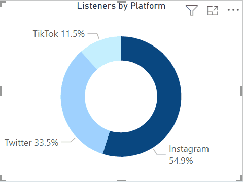

# Analysing and Optimizing Advertisement Strategies for Sway's 2nd Album Release





# This is a Power BI project
A data visualization and business intelligence tool that aids in analysis by allowing users to transform raw data into meaningful insights and interactive reports.
It helps extract data from sources, enable data exploration, perform data modeling, and create visually engaging dashboards and reports.


# Table of contents 

- [Objective](#objective)
- [Data Source](#data-source)
- [Stages](#stages)
- [Design](#design)
- [Project Scope](#project-scope)
- [Development](#development)
  - [Pseudocode](#pseudocode)
  - [Data Exploration](#data-exploration)
  - [Data Cleaning](#data-cleaning)
  - [Data Transformation](#data-transformation)
- [Visualization](#visualization)
  - [Results](#results)
  - [DAX Measures](#dax-measures)
- [Analysis](#analysis)
  - [Project Insight](#project-insight)
- [Recommendations](#recommendations)
  

# Objective 

- What is the key pain point? 

To propel Sway's second album to international stardom by strategically optimising the advertising and marketing strategy. The primary objective is to transform Sway from a regional sensation into a globally recognised and celebrated artist.

- What is the ideal solution? 

The ideal solution would be to create a dashboard that provides insights to propel Sway's second album to international stardom and transform him from a regional sensation into a globally recognised that includes:

- Sway's fan base beyond specific regions 
- navigating the highly competitive music industry, and
- evolving consumer preferences in music consumption 

This will help the marketing and advertisement department of SunMusic make informed decisions and to optimise the insight during campaigns.

# User story

As the SunMusic record label Entertainment Manager, I want to use a dashboard that analyses SunMusic data.
This dashboard should allow me to identify the following:

- Data-Driven Decision Making
- Audience Segmentation
- Compare Effective
- Platform Optimization

With this information, I can make more informed decisions about how to ensure the album's global success and also solidify Sway's position as a rising star in the international music scene.

# Data source

 What data is needed to achieve our objective?
We need data on the SunMusic record label Entertainment that includes:
- Information on 3000 listeners
- Listeners Dataset 
- Competitors Analysis Dataset

# Listeners Dataset:
1.	Listeners_ID: A unique identifier for each listener.
2.	Age: The age of the listener.
3.	Gender: The gender of the listener (Male, Female, Others).
4.	Location: The location of the listener, randomly selected from various cities.
5.	Music_Preferences: The music genre preference of the listener (Pop, HipHop, Alternative, Country, RnB).
6.	Income_Level: The income level of the listener (Low, Medium, High).
7.	Platform: The social media platform the listener is associated with (TikTok, Twitter, Instagram).
8.	Album_Sales: The number of albums a listener has purchased.
9.	Streaming_Numbers: The number of music streams per listener.
10.	Streaming_Platform: The streaming platform used by the listener (Spotify, YouTube, Apple Music, Tidal, Others).
11.	Acquisition_Medium: The method or medium through which the listener was acquired (Organic, Adverts, Radio plays, Influencers).

# Competitors Analysis Dataset
1.	Competitor_Name: The name of the competitor artist.
2.	No_of_Followers: The number of followers or fans the competitor has.
3.	Album_Sales: The competitor's album sales
4.	Streaming_Numbers: The competitor's streaming numbers
5.	Genre: The music genre associated with the competitor (Pop, HipHop, Alternative, RnB, Country).
•	Where is the data coming from? The data is sourced from the SunMusic record label Entertainment.

# Stages

The stages for this project will be;
- Design
- Development
- Analysis

## Design

Dashboard components required
What should the dashboard contain based on the requirements provided?
To understand what it should contain, we need to figure out what questions we need the dashboard to answer:
- What are the total listeners streaming platform used?
- What is the total listeners by acquisition medium?
- What is the total listeners by Income levels?
- What are total listeners by location?
- What is the total listeners by music preferences?
- What are the total listeners by age range?
- What is the total competitor by streaming number?
- What is the total competitor by Genre? 	
- What are the top 5 of the competitor followers? 
- What is the total competitor  by Album Sales?


## Project Scope

| Tool | Purpose |
| --- | --- |
| Excel | Exploring the data |
| Power BI | Cleaning, and Transformation |
| Power BI | Exploring and Analysing the data (EDA)|
| Power BI | Visualizing the data via interactive dashboards |
| GitHub | Hosting the project documentation and version control |


# Development

## Pseudocode

What’s the general approach in creating this solution from start to finish?
1.	Get the data - Data Importation: SunMusic data is imported from its data source into Power BI environment.
2.	Explore the data in Excel
3.	Load the data into Power BI Environment 
4.	Data Cleaning, in Power BI
5.	Data Transform in Power BI
6.	Create KPIs
7.	Data Analysis: The dataset is explored and analysed
4.	Dashboard creation - Data Analysis & Visualization The dataset is visualized in form of dashboard, reports.
5.	Generate the findings based on the insights
6.	Write the documentation + commentary and sent to the stakeholders or marketing and advertising department of SunMusic to optimize the insights during campaigns.
8.	Publish the data to GitHub Pages

#  Data Exploration 

This is the stage where you have a scan of what’s in the data, errors, inconsistencies, bugs, weird and corrupted characters etc
What are your initial observations with this dataset? What’s caught your attention so far?
1.	There are at least 3000 columns that contain the data we need for this analysis, which signals we have everything we need from the file without needing to contact the client for any more data.
2.	We need to create the age range column using a formular or an expression.

# Data Cleaning
- What do we expect the clean data to look like?
The aim is to refine our dataset to ensure it is structured and ready for analysis.
The cleaned data should meet the following criteria and constraints:
- Only relevant columns should be retained.
- All data types should be appropriate for the contents of each column.
- No column should contain null values, indicating complete data for all records.
- What steps are needed to clean and shape the data into the desired format?

# Data Transformation

1. Create a custom column for Age range, this can be done using a formular or an expression.
2. Max - Min ÷ number of ranges (65 - 18  / ÷ 7) = 6.71 approximately  7
3. Then click on Transform data, Power Query , click on add column, custom column 

### Age Range

   ```sql
   
= Table.AddColumn(#"Changed Type", "Age Range", each if [Age] >= 18 and [Age] <= 25 then "18-24"
else if [Age] >= 25 and [Age] <= 31 then "25-31"
else if [Age] >= 32 and [Age] <= 38 then "32-38"
else if [Age] >= 39 and [Age] <= 45 then "39-45"
else if [Age] >= 46 and [Age] <= 52 then "46-52"
else if [Age] >= 53 and [Age] <= 59 then "53-59"
else "Above 60")

```
Click on Close & Apply then Age Range column is created using the formula and then the visualisation.

Below is a table outlining the constraints on our cleaned dataset:

| Property | Description |
| --- | --- |
| Number of Rows | 3000 |
| Number of Columns | 2 |


# Visualization

Results
### What does the dashboard look like for Sways Analysis?




### What does the dashboard look like for Sways Competitors Analysis?



### What does the dashboard look like for the listeners by platform?




The tooltip visualisation is create as a way of providing addition information about a categories.


## DAX Measures

### 1. %females 

```sql
%females = DIVIDE([Female Listeners], [Total Listeners], 0)
RETURN %females

```
### 2. %males 
```sql
%males = DIVIDE([Male Listeners], [Total Listeners], 0)
RETURN %males

```
### 3. %others
```sql
%others = DIVIDE([Other Listeners], [Total Listeners], 0)
RETURN %others

```
### 4. Album Sales

```sql
Album Sales = SUM(listeners_dataset[Album_Sales])
RETURN %others

```
### 5. Comp Album Sales
```sql
Comp Album Sales = SUM(competitors_analysis_dataset[Album_Sales])
RETURN Comp Album Sales

```
### 6. Comp Followers/Listeners
```sql
Comp Followers/Listeners = SUM(competitors_analysis_dataset[No_of_Followers])
RETURN Comp Followers/Listeners

```
### 6. Comp Streaming No
```sql
Comp Streaming No = SUM(competitors_analysis_dataset[Streaming_Numbers])
RETURN Comp Streaming No
```
### 7. Female Listeners
```sql
Female Listeners = CALCULATE(COUNTROWS(listeners_dataset), listeners_dataset[Gender] = "Female")
RETURN Female Listeners

```
### 8. Male Listeners
```sql
Male Listeners = CALCULATE(COUNTROWS(listeners_dataset), listeners_dataset[Gender] = "Male")
RETURN Male Listeners

```
### 9. Other Listeners
```sql
Other Listeners = IF(
    ISBLANK(CALCULATE(COUNTROWS(listeners_dataset), listeners_dataset[Gender] = "Others")),
    0,
    CALCULATE(COUNTROWS(listeners_dataset), listeners_dataset[Gender] = "Others")
)
RETURN Other Listeners

```
### 10. Streaming Numbers
```sql
Streaming Numbers = SUM(listeners_dataset[Streaming_Numbers])
RETURN Streaming Numbers

```
### 11. Total Competitors
```sql
Total Competitors = COUNTROWS(competitors_analysis_dataset)
RETURN Total Competitors
```
### 12. Total Listeners
```sql
Total Listeners = COUNTROWS(listeners_dataset)
RETURN Total Listeners
```

# Analysis

## Project Insight

  What did we find?
- From Sway's 3,000 listeners which comprises, 50.8% female, 46.7% male and 2.5% Others.
- A significant proportion of her listeners fall within the age bracket of 39 to 45.
- The predominant musical preference among her audience is pop. Furthermore, the majority of the listeners belong to the low-income demographic.
- Geographically, the highest concentration of her audience is situated in Melbourne.
- Among the ten competitors, Sway's album sales and streaming numbers ranked the lowest. However, Sway boasts of a good presence on social media, with 3k followers/listeners, making her the fourth highest among her competitors. Additionally, she has a significant following on Instagram.
- Sway contends with ten major rivals. Chris Sounds leads in album sales with 4,500 units sold. Furthermore, Melodic Maven leads in followers count while Electro vibe leads in streaming numbers in Lagos.
- In Lagos, Sway's audience tends to lean towards Hip-Hop, while Pop takes the lead in other the locations.
- London's audience exhibits a higher prevalence in the age range 18-25, whereas Tokyo sees a larger demographic between the age range of 32-38
- Sway contends with ten major rivals. Chris Sounds leads in album sales with 4,500 units sold. Furthermore, Melodic Maven leads in followers count while Electro vibe leads in streaming numbers.
- The majority of Sway listeners were acquired through advertising effort which includes online and streaming ads
- The majority of Sway's listeners were acquired through advertising efforts.
- Spotify was the streaming platformed most used by Sway's listeners.
  


# Recommendations

What do you recommend based on the insights gathered?
  
In order to enhance her marketing optimization efforts, Sway should capitalize on additional social media platforms to expand her fanbase by increasing her social presence and interaction on platforms where she's lagging behind such as Twitter and Tik-Tok. This approach will not only bolster her social media engagement but also contribute to increased streaming figures and album sales.

### Listeners within the age of 39-45 engaged the most with Sway's music. In order to expand her audience to other age group, Sway can:

1.	Experiment with different musical styles or genres that appeal to a broader demographic. This may involve collaborating with artists from other genres or incorporating elements from various musical traditions.
2.	Create content, such as music videos or lyric videos, that resonates with different age groups. For example, she could create videos with themes or storylines that appeal to a younger audience or produce content that connects with older listeners.
3.	Collaborate with artists who have fans in other age ranges such as Rhythmic Rival and Melodic Maven can help Sway tap into new audiences. These collaborations can introduce her music to a wider demographic.
   
   
### Sways has more low income level earners as listeners, to attract a more diverse audience that includes medium and high-income individuals:

1. Consider advertising in upscale magazines, lifestyle blogs, or social media platforms popular among medium and high-income demographics.
2.	Create ad campaigns tailored to the interests and preferences of medium and high-income individuals.
3.	Collaborate with established artists who have a following among medium and high-income audiences. These collaborations can introduce her to new fans.
4.	Partner with social media influencers or bloggers who have a significant following among the desired demographic. Their endorsement can help her gain credibility and reach.
5.	Partner with charitable organizations or causes that resonate with medium and high-income individuals. This can help her connect with those who appreciate socially conscious artists.
   
   
### Sway's listeners are more in Melbourne, to expand her listener base in locations beyond Melbourne, the following strategies can be employed:

1.	Create marketing campaigns specifically tailored to each of the other locations where she has listeners. This can include localized social media advertising, event promotions, and targeted outreach.
2.	Collaborate with artists and influencers from those regions to tap into their local fan base. Joint projects or performances can help her gain visibility in new areas. Reach out to local radio stations, and online publications in those areas. Getting featured in local media and magazine shoot, for example 'Vogue Asia' , or Glamour Africa help introduce her music to a broader local audience.31.	Plan concerts or mini tours in the regions where she wants to expand her listener base.
3.	On acquisition channel, it seems like a lot of listeners came in through adverts, Sway's team should continue investing in advertising campaigns that have proven successful in acquiring listeners and this medium should have a larger portion of the budget funds.
Because Spotify and YouTube were the most used streaming platform, a lot of energy should be directed there during market, and the team can also focus on where she is rarely known such as tidal.
