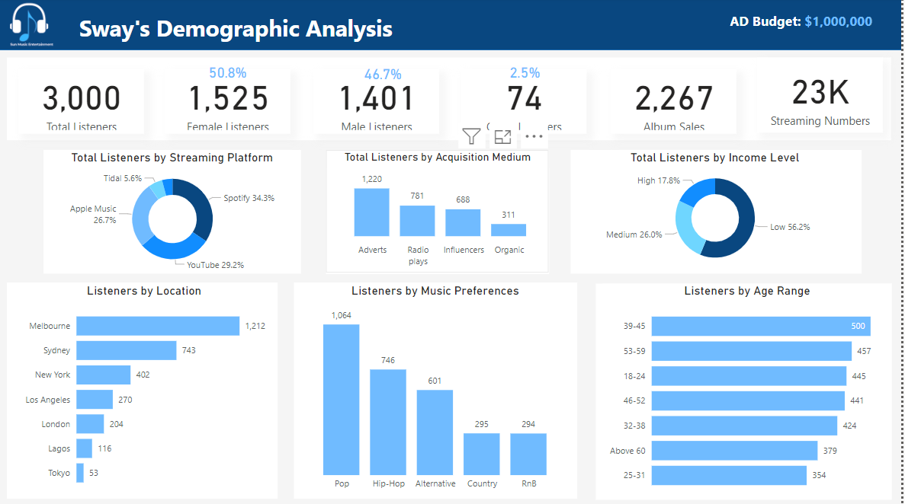
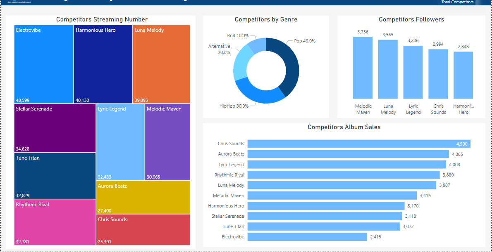
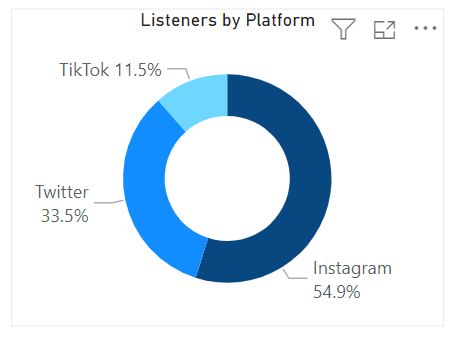

# Sway's 2nd Album Release

## Analyzing and Optimizing Advertisement Strategies

# Table of contents 

- [Objective](#objective)
- [Data Source](#data-source)
- [Stages](#stages)
- [Design](#design)
  - [Mockup](#mockup)
  - [Tools](#tools)
- [Development](#development)
  - [Pseudocode](#pseudocode)
  - [Data Exploration](#data-exploration)
  - [Data Cleaning](#data-cleaning)
  - [Transform the Data](#transform-the-data)
  - [Create the SQL View](#create-the-sql-view)
- [Testing](#testing)
  - [Data Quality Tests](#data-quality-tests)
- [Visualization](#visualization)
  - [Results](#results)
  - [DAX Measures](#dax-measures)
- [Analysis](#analysis)
  - [Findings](#findings)
  - [Validation](#validation)
  - [Discovery](#discovery)
- [Recommendations](#recommendations)
  - [Potential ROI](#potential-roi)
  - [Potential Courses of Actions](#potential-courses-of-actions)
 

# Business Overview/Problem

 The prevailing business challenge is to optimize the marketing and advertisement strategy for Sway's second album release to ensure it gains global recognition and success. Some challenges include:

1. Limited Global Reach: Presently, Sway's popularity is confined to specific regional pockets, posing a significant hurdle in achieving global recognition. A crucial task is expanding Sway's fan base to encompass a worldwide audience, thereby broadening the album's reach.

2. Intense Competition: The music industry operates within an environment of cutthroat competition, intensifying the difficulties faced by emerging artists. Navigating this fiercely competitive landscape necessitates a carefully crafted advertising strategy that can help Sway stand out amidst a sea of talent.
3. Evolving Consumer Preferences: The music consumption landscape is continuously shifting, driven by rapid changes in technology and consumer behavior. Staying attuned to these dynamic preferences is imperative, as it demands continuous adaptation and innovation in our marketing approach to effectively connect with the target audience on the platforms they favor.

# Rationale for the Project
 
Marketing & Advertising analysis will help SunMusic reduce business risks, effectively connect with the target audience, provide the right songs, and align with the latest music trends. It provides the data and insights necessary to develop a targeted and effective marketing strategy that aligns with the business objective of achieving global recognition and success. These will address the business problems through:

1. Data-Driven Decision Making: Marketing analytics provides valuable insights and data-driven intelligence that can guide decision-makers in crafting an effective marketing strategy. By analyzing data, businesses can identify which regions or countries have the most potential for growth and allocate resources accordingly.
 
2. Audience Segmentation: Analytics can help identify and segment the target audience in regions where Sway is not prominent. By understanding the demographics, preferences, and behaviors of potential fans, marketing efforts can be tailored to resonate with specific audience segments.
 
3. Campaign Effectiveness: Analytics can track the performance of marketing campaigns in real-time. This means that if a particular campaign is not yielding the desired results in a specific region, adjustments can be made quickly to improve its effectiveness.
 
4. Platform Optimization: Given the evolving consumer preferences and the importance of digital platforms, analytics can help identify which online channels and platforms are most effective for reaching and engaging with the target audience.

# Aim of the Project
The aim of this project is to propel Sway's second album to international stardom by strategically optimizing the advertising and marketing strategy. The primary objective is to transform Sway from a regional sensation into a globally recognized and celebrated artist. 

 To achieve this, the project seeks to overcome several key challenges, including expanding Sway's fan base beyond specific regions, navigating the highly competitive music industry, and adapting to evolving consumer preferences in music consumption. A crucial aspect of this endeavor involves harnessing the expertise of data analysts, who will be responsible for collecting, analyzing, and interpreting extensive data sets related to audience demographics, social media, and historical data. 

 By leveraging marketing analytics and the insights generated by data analysts, innovative campaigns and data-driven decision-making will be employed. This approach aims to not only ensure the album's global success but also solidify Sway's position as a rising star in the international music scene.

# Data Description
 
## SunMusic has information on 3000 listeners, which will be analyze for actionable insights:

## Listeners Dataset:

1. Listeners_ID: A unique identifier for each listener.
2. Age: The age of the listener.
3. Gender: The gender of the listener (Male, Female, Others).
4. Location: The location of the listener, randomly selected from various cities.
5. Music_Preferences: The music genre preference of the listener (Pop, HipHop, Alternative, Country, RnB).
6. Income_Level: The income level of the listener (Low, Medium, High).
7. Platform: The social media platform the listener is associated with (TikTok, Twitter, Instagram).
8. Album_Sales: The number of albums a listener has purchased.
9. Streaming_Numbers: The number of music streams per listener.
10. Streaming_Platform: The streaming platform used by the listener (Spotify, YouTube, Apple Music, Tidal, Others).
11. Acquisition_Medium: The method or medium through which the listener was acquired (Organic, Adverts, Radio plays, Influencers).

## Competitors Analysis Dataset

1. Competitor_Name: The name of the competitor artist.
2.  No_of_Followers: The number of followers or fans the competitor has.
3.  Album_Sales: The competitor's album sales
4.  Streaming_Numbers: The competitor's streaming numbers
5.  Genre: The music genre associated with the competitor (Pop, HipHop, Alternative, RnB, Country).

# Tech Stack
## Power BI : A data visualization and business intelligence tool that aids in analysis by allowing users to transform raw data into meaningful insights and interactive reports. 

It helps extract data from sources, enable data exploration,  perform data modeling, and create visually engaging dashboards and reports.

## Project Scope
1. Data Importation: SunMusic data is imported from its data source into Power BI environment.

2.Data Cleaning & Transformation:  Data is cleaned and transformed in Power BI

3.Data Analysis: The dataset is explored and analysed 

4. Data Analysis & Visualization: The dataset is visualized in form of dashboard, reports and sent to the stakeholders or marketing and advertising department of SunMusic to optimize the insights during campaigns.

# Project Insight
- From Sway's 3,000 listeners which comprises,  50.8% female, 46.7% male and 2.5% Others. 

- A significant proportion of her listeners fall within the age bracket of 39 to 45. 

- The predominant musical preference among her audience is pop. Furthermore, the majority of the listeners belong to the low-income demographic. 

- Geographically, the highest concentration of her audience is situated in Melbourne.

- Among the ten competitors, Sway's album sales and streaming numbers ranked the lowest. However, Sway boasts of a good presence on social media, with 3k  followers/listeners, making her the fourth highest among her competitors. Additionally, she has a significant following on Instagram.

- Sway contends with ten major rivals. Chris Sounds leads in album sales with 4,500 units sold. Furthermore, Melodic Maven leads in followers count while Electrovibe leads in streaming numbers in Lagos. 

- In Lagos, Sway's audience tends to lean towards Hip-Hop, while Pop takes the lead in other the locations.

- London's audience exhibits a higher prevalence in the age range 18-25, whereas Tokyo sees a larger demographic between the age range of 32-38

- Sway contends with ten major rivals. Chris Sounds leads in album sales with 4,500 units sold. Furthermore, Melodic Maven leads in followers count while Electrovibe leads in streaming numbers.

- The majority of Sway listeners were acquired through advertising effort which includes online and streaming ads

- The majority of Sway's listeners were acquired through advertising efforts.

- Spotify was the streaming platformed most used by Sway's listeners.
 
# Recommendations

In order to enhance her marketing optimization efforts, Sway should capitalize on additional social media platforms to expand her fanbase by  increasing her social presence and interaction on platforms where she's lagging behind such as Twitter and Tik-Tok. This approach will not only bolster her social media engagement but also contribute to increased streaming figures and  album sales.

## Listeners within the age of 39-45 engaged the most with Sway's music. In order to expand her audience to other age group, Sway can:

1. Experiment with different musical styles or genres that appeal to a broader demographic. This may involve collaborating with artists from other genres or incorporating elements from various musical traditions.
2. Create content, such as music videos or lyric videos, that resonates with different age groups. For example, she could create videos with themes or storylines that appeal to a younger audience or produce content that connects with older listeners.
3. Collaborate with artists who have fans in other age ranges such as Rhythmic Rival and Melodic Maven can help Sway tap into new audiences. These collaborations can introduce her music to a wider demographic.

## Sway's has more low income level earners as listeners, to attract a more diverse audience that includes medium and high-income individuals:

4. Consider advertising in upscale magazines, lifestyle blogs, or social media platforms popular among medium and high-income demographics.
5. Create ad campaigns tailored to the interests and preferences of medium and high-income individuals.
6. Collaborate with established artists who have a following among medium and high-income audiences. These collaborations can introduce her to new fans.
7. Partner with social media influencers or bloggers who have a significant following among the desired demographic. Their endorsement can help her gain credibility and reach.
8. Partner with charitable organizations or causes that resonate with medium and high-income individuals. This can help her connect with those who appreciate socially conscious artists. 

## Sway's listeners are more in Melbourne, to expand her listener base in locations beyond Melbourne, the following strategies can be employed:

9. Create marketing campaigns specifically tailored to each of the other locations where she has listeners. This can include localized social media advertising, event promotions, and targeted outreach.
10. Collaborate with artists and influencers from those regions to tap into their local fan base. Joint projects or performances can help her gain visibility in new areas.
Reach out to local radio stations, and online publications in those areas. Getting featured in local media and magazine shoot, for example 'Vogue Asia' , or Glamour Africa help introduce her music to a broader local audience.
11. Plan concerts or mini-tours in the regions where she wants to expand her listener base.

12. On acquisition channel, it seems like a lot of listeners came in through adverts, Sway's team should continue investing in advertising campaigns that have proven successful in acquiring listeners and this medium should have a larger portion of the budget funds. 

Because spotify and youtube was the most used streaming platform, a lot of energy should be directed there during market, and the team can also focus on where she is rarely known such as tidal.

